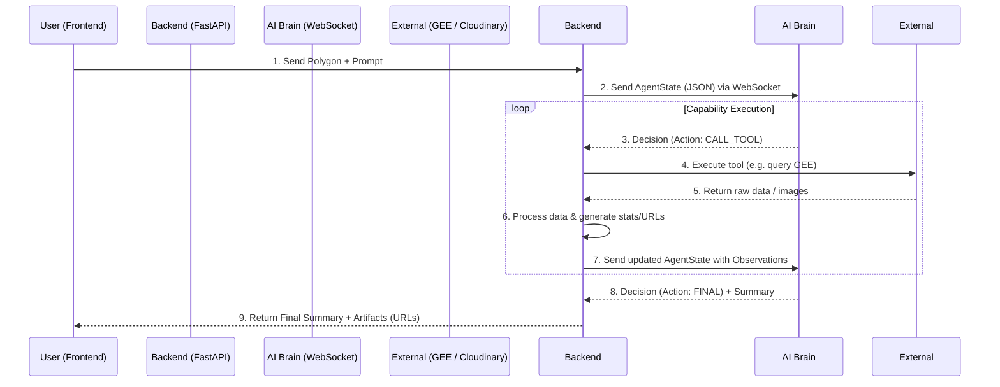

# AI Brain Interaction Architecture

This document outlines the current plan and technical architecture for how the SatQuery Backend interacts with the "Friend's AI Brain".

## 1. High-Level Workflow

The system acts as an orchestrator, bridging the user's frontend interface with the AI Brain's decision-making, while the backend does all the heavy computational lifting.



## 2. The AgentState Payload (Backend -> Brain)

For every step in the loop, the Backend sends the current `AgentState` to the AI Brain. This provides the AI with the user's request, geographic context, and the results of any tools it previously asked to run.

```json
{
  "job_id": "uuid-1234",
  "user_request": "Show me the 3D terrain and NDVI changes over 5 years.",
  "current_step": 1,
  
  // SPATIAL CONTEXT (Phase 6)
  "aoi": {
    "type": "Polygon",
    "coordinates": [[[-122.4, 37.7], [-122.3, 37.7], [-122.3, 37.8], [-122.4, 37.7]]]
  },
  "aoi_area_km2": 12.5,
  "aoi_bbox": [-122.4, 37.7, -122.3, 37.8],

  // CAPABILITY OBSERVATIONS (Phases 7-9)
  // Results of the tools the AI requested. 
  // Notice we send URLs and statistics, NOT raw image pixels.
  "observations": [
    {
      "step_number": 0,
      "source_capability": "retrieve_temporal_imagery",
      "status": "success",
      "result": {
         "years": [2019, 2024],
         "ndvi_change": -0.15,
         "summary": "Vegetation decreased by 15%"
      }
    },
    {
      "step_number": 1,
      "source_capability": "generate_timeline_animation",
      "status": "success",
      "result": {
         "format": "gif",
         "animation_url": "https://res.cloudinary.com/satquery/timeline.gif"
      }
    }
  ],
  
  "finished": false
}
```

## 3. The Decision Payload (Brain -> Backend)

The AI Brain responds with a `Decision` payload. It can either request a tool execution (`CALL_TOOL`) or finish the job (`FINAL`).

### Option A: Call a Tool
```json
{
  "type": "decision",
  "action": "CALL_TOOL",
  "capability": "generate_terrain_3d",
  "arguments": {
    "dem_url": "USGS/3DEP/10m",
    "aoi": { ... }
  },
  "reason": "User requested a 3D visualization of the area."
}
```

### Option B: Final Answer
```json
{
  "type": "decision",
  "action": "FINAL",
  "answer": "Based on the satellite data, there was a 15% decrease in vegetation. Here is the 3D terrain model and the timeline animation of the changes.",
  "confidence": 0.95
}
```

## 4. Current Available Capabilities (Tools)

The AI Brain has access to the following tools via the Capability Registry:

| Capability Name | Phase | Description | What the Backend Does |
|---|---|---|---|
| `validate_remote_sensing_input` | 6 | Validates AOI geometry | Calculates area and validates bounds using Shapely |
| `retrieve_satellite_imagery` | 7 | Gets a single scene | Queries GEE (Sentinel/Landsat), returns cloud cover & metadata |
| `retrieve_dem` | 7 | Gets elevation data | Queries USGS 3DEP via GEE, returns min/max elevation stats |
| `generate_terrain_2d` | 8 | 2D map views | Generates hillshade and contour maps, returns Cloudinary URLs |
| `generate_terrain_3d` | 8 | 3D mesh generation | Converts DEM to .glb mesh, returns Cloudinary URL |
| `retrieve_temporal_imagery` | 9 | Multi-year analysis | Gets best scenes per year, aligns them, calculates NDVI |
| `generate_timeline_animation` | 9 | Timelapses | Renders frames to GIF/MP4, returns Cloudinary URL |

## 5. Handling Heavy Data (Images/Rasters)

1. **No Raw Pixels to AI:** Raw `.tif` rasters and multi-megabyte image arrays are never sent over the WebSocket to the AI Brain.
2. **Backend Processing:** All pixel-level math (NDVI calculation, cross-correlation alignment, hillshade generation) happens locally in the Python Backend using `numpy`, `scipy`, and `rasterio`.
3. **Delegation of Vision:** The AI Brain does not "look" at the images. It relies on the statistical summaries generated by the Python Backend (e.g. `ndvi_change: -0.15`).
4. **Visuals for the User:** When the AI Brain wants to show the user an image (like a 3D mesh or a GIF), the Python Backend renders it, uploads it to Cloudinary, and passes the **Cloudinary URL** to the AI Brain, which then passes that URL to the Frontend to render.
