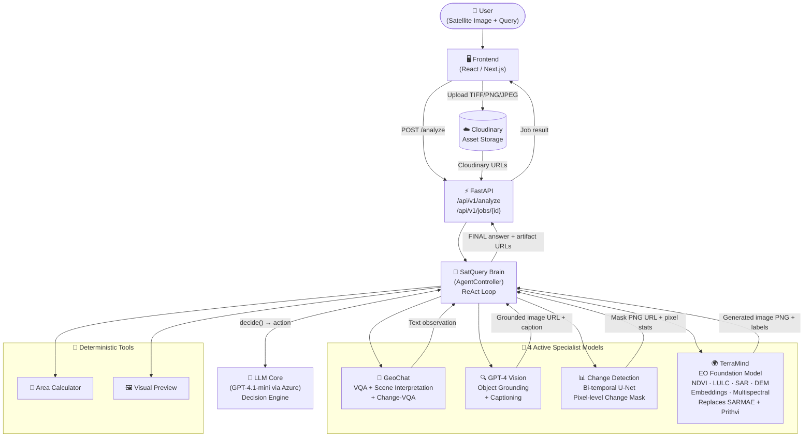

# SatQuery Brain — Final Architecture

## System Overview



---

## Active Model Roster

| # | Model | Capabilities | Notes |
|---|-------|-------------|-------|
| 1 | **GeoChat** | `answer_remote_sensing_vqa`, `interpret_scene`, `answer_change_vqa` | VQA + scene text. Auto TIFF→PNG |
| 2 | **GPT-4 Vision** | `ground_region`, `generate_caption` | Bounding boxes + captions. Auto TIFF→PNG |
| 3 | **Change Detection** | `detect_bitemporal_change` | Bi-temporal U-Net. rasterio TIFF handling |
| 4 | **TerraMind** | `terramind_generate`, `terramind_tim`, `terramind_embedding`, `analyze_sar_image`, `analyze_multispectral_image` | Native TIFF. Replaces SARMAE + Prithvi |

> [!IMPORTANT]
> **Prithvi** and **SARMAE** are **RETIRED**. SAR queries → `terramind_generate` with `output_modalities=S1GRD`. Multispectral → `terramind_tim` with `tim_modalities=LULC/NDVI`.

---

## Query Routing Table

```
User Query Type              → Correct Capability
────────────────────────────────────────────────────────────────
"Describe the scene"         → interpret_scene (GeoChat)
"What do you see?"           → answer_remote_sensing_vqa (GeoChat)
"What changed between..."    → answer_change_vqa + detect_bitemporal_change
"Detect buildings/objects"   → ground_region (GPT-4 Vision)
"Generate a caption"         → generate_caption (GPT-4 Vision)
"NDVI / vegetation health"   → terramind_generate, output_modalities=NDVI
"Land use / LULC"            → terramind_tim, tim_modalities=LULC
"SAR / radar"                → terramind_generate, output_modalities=S1GRD  ← was SARMAE
"Multispectral analysis"     → terramind_tim or terramind_generate          ← was Prithvi
"Elevation / DEM"            → terramind_generate, output_modalities=DEM
"How many km2 changed?"      → detect_bitemporal_change + calculate_changed_area
"Feature embeddings"         → terramind_embedding
```

---

## Final System Prompt (Section 3 — Active)

```
## 3. SPECIALIST MODEL REFERENCE (ACTIVE MODELS ONLY)

**CRITICAL FORMAT NOTE:** ALL models accept ANY image format including
GeoTIFF (.tif/.tiff), PNG, JPEG, and WEBP. Backend auto-converts TIFF.
NEVER refuse to analyze an image because of its format.

**ACTIVE MODEL ROSTER -- 4 specialist models:**
1. GeoChat          -- VQA, scene interpretation, change-VQA
2. GPT-4 Vision     -- Object grounding (bounding boxes) + captioning
3. Change Detection -- Bi-temporal pixel-level change mask (U-Net)
4. TerraMind        -- Foundation model: NDVI, LULC, SAR, DEM, embeddings

**RETIRED -- DO NOT USE:** Prithvi and SARMAE are OFFLINE.
TerraMind now handles ALL SAR and multispectral analysis.

### 3a. GeoChat (VQA + Scene Interpretation)
- Capability Names: answer_remote_sensing_vqa, interpret_scene, answer_change_vqa
- Input single image: {"asset": "<asset_id>", "prompt": "<your question>"}
- Input change-VQA:   {"assets": ["<before_id>", "<after_id>"], "prompt": "what changed?"}
- Output: Text scene description only. No masks, no math.

### 3b. TerraMind (EO Foundation Model -- ALL spectral + SAR queries)
- Capability Names: terramind_tim, terramind_generate, terramind_embedding,
  analyze_sar_image, analyze_multispectral_image
- SAR ROUTING: For ANY SAR/radar query → terramind_generate, output_modalities=S1GRD
- Input terramind_tim:       {"asset": "<id>", "modality": "RGB", "tim_modalities": "LULC"}
- Input terramind_generate:  {"asset": "<id>", "modality": "RGB", "output_modalities": "NDVI", "include_png": true}
- Input terramind_embedding: {"asset": "<id>", "modality": "RGB"}
- CRITICAL: "asset" key is MANDATORY for all terramind_* capabilities.
- MODALITY GUIDE:
  * S1GRD -- SAR. Structures, vessels, cloud-obscured areas.
  * LULC  -- Land Use/Land Cover classification.
  * NDVI  -- Vegetation. Works on plain RGB PNG.
  * DEM   -- Elevation and topography.

### 3c. GPT-4 Vision (Object Grounding + Captioning)
- Capability Names: ground_region, generate_caption
- Input: {"asset": "<asset_id>"}  ← "asset" is MANDATORY
- Output: Cloudinary URL with bounding boxes + caption.

### 3d. Change Detection (Bi-temporal U-Net)
- Capability Name: detect_bitemporal_change
- Input: {"before_asset": "<id_1>", "after_asset": "<id_2>"}
- Output: Binary mask PNG + pixel stats.
- CAVEAT: Prone to pixel bleed. Treat as CEILING ESTIMATE.

### 3e. Area Calculation (Deterministic Math)
- Capability Name: calculate_changed_area
- Input: {"change_mask": "<mask_uri>"}
- Output: area_km2, area_m2, changed_pixels, total_pixels.
```

---

## TIFF Processing Pipeline

```
TIFF image uploaded to Cloudinary
            │
            ├─► TerraMind       ── Native TIFF (no conversion)
            │
            ├─► Change Detection ── rasterio to_rgb8_png()
            │                       per-band 2%-98% stretch → PNG
            │
            ├─► GeoChat         ── PIL TIFF detection
            │                       percentile stretch → PNG
            │
            └─► GPT-4 Vision    ── PIL TIFF detection
                                    percentile stretch → PNG
```

---

## Commit History

| Commit | Description |
|--------|-------------|
| `e06e9ae` | GeoChat: TIFF auto-conversion to PNG |
| `2a0748d` | GPT Vision: TIFF auto-conversion + LLM TIFF format note |
| `07eb07f` | Fix SyntaxError in openai.py |
| `latest` | Retire Prithvi/SARMAE → TerraMind; clean system prompt |
